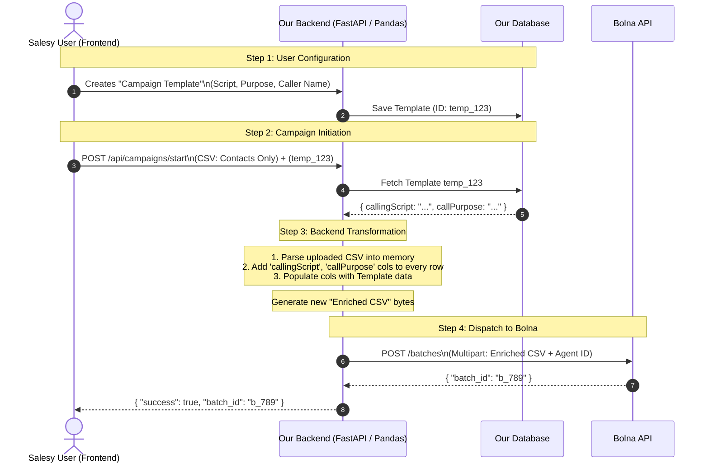

# 🏗️ Architecture: Dynamic Templates with Bolna Batch Calling

## 1. The Challenge
In our existing **Single Call API**, we pass dynamic fields like `callPurpose`, `callerName`, and `callingScript` via a **JSON payload**. 

However, **Bolna's Batch Calling API** does not accept a JSON payload for variables. It strictly expects:
1. An `agent_id`
2. A **CSV file** 

For Bolna to use dynamic context in a batch call, the variables **must exist as columns in the CSV file**. 

From a UX perspective, we **cannot** ask our users to manually copy/paste a massive 500-word `callingScript` into every row of their CSV spreadheet before uploading. It would break the user experience of the Salesy app.

## 2. The Solution: "Backend CSV Interception"
We will allow the user to select a predefined **Template** (which contains the script, purpose, org name, etc.) and map it to a simple CSV containing only their contacts. 

Our backend will act as a **middleware**. It will intercept the user's simple CSV, merge it with the chosen Template data in memory, and generate a new "enriched" CSV to send to Bolna.

---

## 3. Architectural Flow Diagram



---

## 4. Why This Architecture is Ideal

### ✅ 1. Perfect User Experience
The user only interacts with clean, simple data. Their CSV only needs to contain what actually changes per lead:
```csv
contact_number,leadName,leadCompany
+916261652154,Shivi,Hashtechy
+917984523385,Rahul,TestCo
```

### ✅ 2. 100% Compatible with Bolna
Bolna gets exactly what it demands. By the time the CSV reaches Bolna, our backend has transformed it into this:
```csv
contact_number,leadName,leadCompany,callPurpose,callingScript,callerName,orgName
+916261652154,Shivi,Hashtechy,"Quick Intro","- Introduce...","- Ask...","Salesy","Hashtechy"
+917984523385,Rahul,TestCo,"Quick Intro","- Introduce...","- Ask...","Salesy","Hashtechy"
```

### ✅ 3. Highly Scalable & Fast
Adding columns to a CSV in memory using Python (via `pandas` or Python's native [csv](file:///d:/Calling-Agent/test_batch.csv) module) is incredibly fast. Modifying a 10,000-row CSV takes **less than 100 milliseconds** on the backend.

### ✅ 4. Future-Proof for A/B Testing
Because our backend controls the final CSV generation, we can easily build advanced features later without changing Bolna. 
*Example: A/B Testing.* The user selects two templates. Our backend automatically assigns Template A to 50% of the rows and Template B to the other 50% before sending it to Bolna.

## 5. Implementation Requirements (Backend)

To implement this flow, we will need to modify our upcoming `/api/bolna/batches` route:

1. **Accept New Param:** Accept a `template_id` (or the raw JSON payload of the template) alongside the file upload. 
2. **Transform Function:** Write a small utility function using Python's `io.StringIO` and `csv.DictReader`/`csv.DictWriter` to process the uploaded bytes.
3. **Pass Enriched Data:** Pass the transformed bytes down to `bolna_service.create_batch()` instead of the raw user bytes.

There are no changes required to Bolna, and the system prompt on Bolna's dashboard remains full of `{{placeholders}}` just like a Single Call setup.
